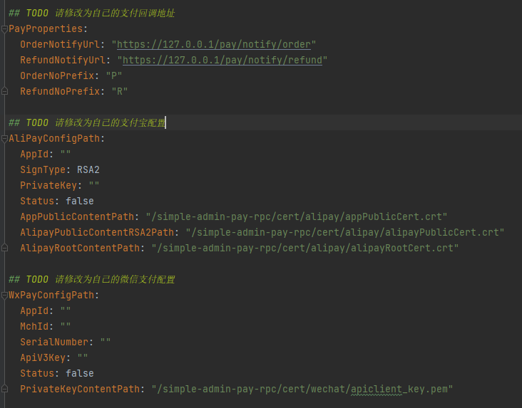

# 支付接入

## 项目介绍

本项目是一个支付接入项目，目前支持微信支付和支付宝支付，后续会支持更多的支付渠道。

## 1. 第一步，配置支付渠道

1. 在[pay-rpc](https://github.com/agui-coder/simple-admin-pay-rpc)的etc/pay.yaml(./internal/logic/app)中配置支付

* 支付结果的回调地址：这里因为我们在本地演示，所以使用了 127.0.0.1 IP 地址，如果你部署到服务器上，要设置服务器可调用到的 IP 地址。
* 本项目使用 asynq pub/sub，asynq推荐使用
[Simple Admin Job](https://doc.ryansu.tech/zh/guide/official-comp/cron.html)添加消息者,有可以参照[fork pay-job分支示例](https://github.com/agui-coder/simple-admin-job)
* 如果回调地址是本地最好配置内网穿透，否则微信无法访问到回调地址，可以使用贝锐花生壳进行内网穿透，具体的可以参考[花生壳官方文档](https://hsk.oray.com/)

## [微信支付测试](./doc/weixin/README.md)

## [支付宝支付测试](./doc/ali/README.md)

[@Kevin](https://github.com/agui-coder)

## License

[MIT © Kevin-2023](./LICENSE)