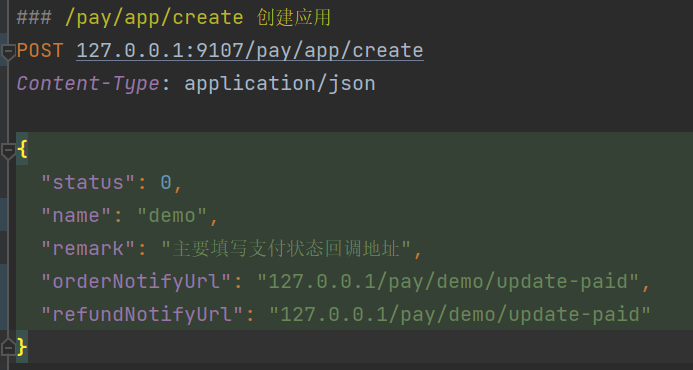
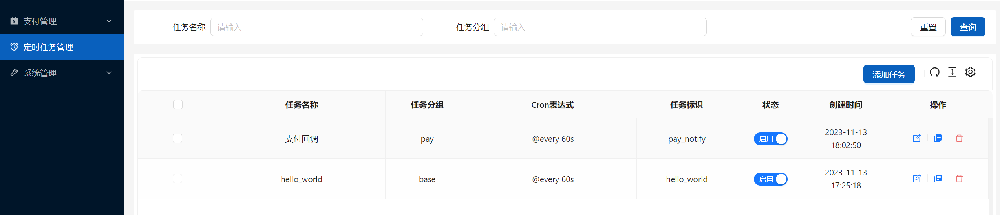
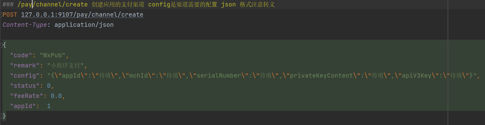
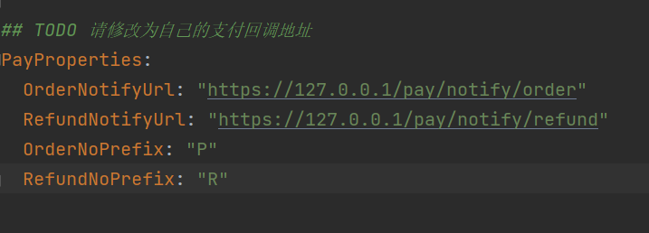

# 支付接入

## 项目介绍

本项目是一个支付接入项目，目前支持微信支付和支付宝支付，后续会支持更多的支付渠道。

## 1. 第一步，配置支付渠道

1. 在[create_app.http](./internal/logic/app)中配置支付应用

* 支付结果的回调地址：这里因为我们在本地演示，所以使用了 127.0.0.1 IP 地址，如果你部署到服务器上，要设置服务器可调用到的 IP 地址。
* 本项目使用 asynq 进行定时查询数据库表中pay_notify_task的支付回调任务执行，asynq推荐使用[simple Admin](https://doc.ryansu.tech/)然后添加
[Simple Admin Job](https://doc.ryansu.tech/zh/guide/official-comp/cron.html)
添加定时任务

2. 在[create_channel.http](./internal/logic/channel)中配置支付渠道

## 2. 第二步，支付回调配置
 支付回调配置，修改[pay.yaml](./etc/pay.yaml)中的配置

* 如果回调地址是本地最好配置内网穿透，否则微信无法访问到回调地址，可以使用贝锐花生壳进行内网穿透，具体的可以参考[花生壳官方文档](https://hsk.oray.com/)

## [微信支付测试](./common/pay/weixin/README.md)

## [支付宝支付测试](./common/pay/ali/README.md)

[@Kevin](https://github.com/agui-coder)

## License

[MIT © Kevin-2023](./LICENSE)