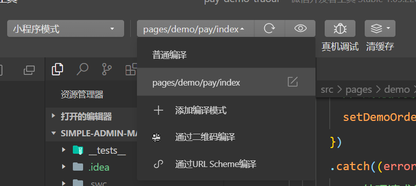
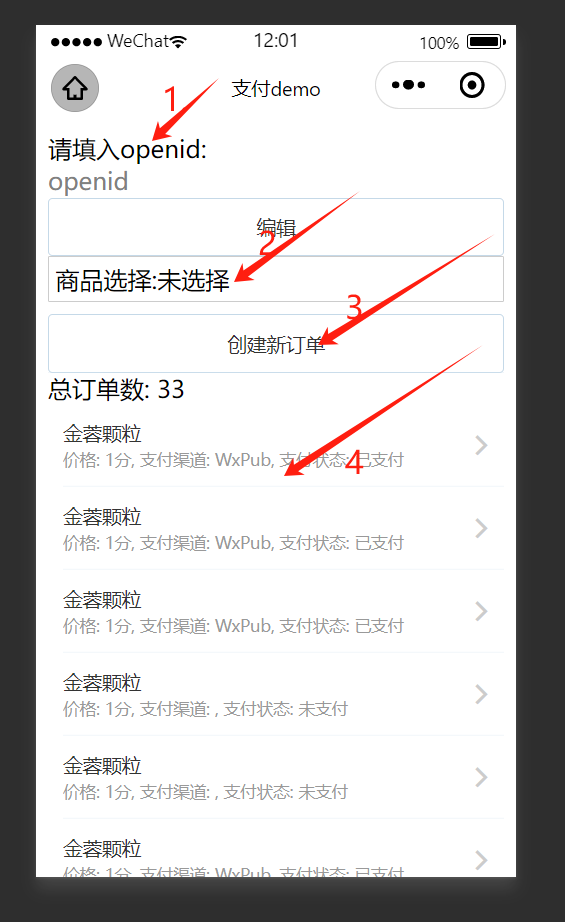

# 支付接入

## 0.概述 

[pay-demo-taroui](./pay-demo-taroui)中提供了简单的微信demo支付接入,需要在微信环境中进行,
需要准备好微信支付的相关信息,具体的可以参考[微信支付的官方文档](https://pay.weixin.qq.com/)

## 1. 第一步，配置支付渠道

1. 在[create_app.http](./internal/logic/app)中配置支付应用

* 支付结果的回调地址：这里因为我们在本地演示，所以使用了 127.0.0.1 IP 地址，如果你部署到服务器上，要设置服务器可调用到的 IP 地址。
* 本项目使用 asynq 进行定时查询数据库表中pay_notify_task的支付回调任务执行，asynq推荐使用[simple Admin](https://doc.ryansu.tech/)然后添加
[Simple Admin Job](https://doc.ryansu.tech/zh/guide/official-comp/cron.html)
添加定时任务

2. 在[create_channel.http](./internal/logic/channel)中配置支付渠道

## 2. 第二步，支付回调配置
 支付回调配置，修改[pay.yaml](./etc/pay.yaml)中的配置

* 如果回调地址是本地最好配置内网穿透，否则微信无法访问到回调地址，可以使用贝锐花生壳进行内网穿透，具体的可以参考[花生壳官方文档](https://hsk.oray.com/)

## 3. 第三步，运行微信小程序demo

1. 打开[微信开发者工具](https://developers.weixin.qq.com/miniprogram/dev/devtools/download.html)，选择「小程序」，点击「添加项目」，填写小程序的 AppID，点击「确定」。
2. 在[微信公众平台](https://mp.weixin.qq.com/)中，选择「开发」->「开发设置」，将微信开发者工具中的 AppID 填写到「开发者ID」中，点击「确定」。
3. 选择「详情」 ->「本地开发」，勾选不校验合法域名、web-view（业务域名）、TLS 版本以及 HTTPS 证书，点击「确定」。
4. 进入[demo目录](./pay-demo-taroui)打开终端 

    使用 npm 安装 CLI
    $ npm install -g @tarojs/cli
    使用pnpm安装依赖
    $ pnpm install
    使用 npm 编译运行
    $ npm run dev:weapp

5. 选择编译模式后刷新微信开发者工具，即可看到效果。

## 4. 第四步，支付功能测试

openid可以在通过[Simple Admin Member](https://doc.ryansu.tech/zh/guide/official-comp/member.html)模块中获取

