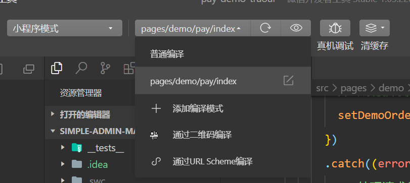
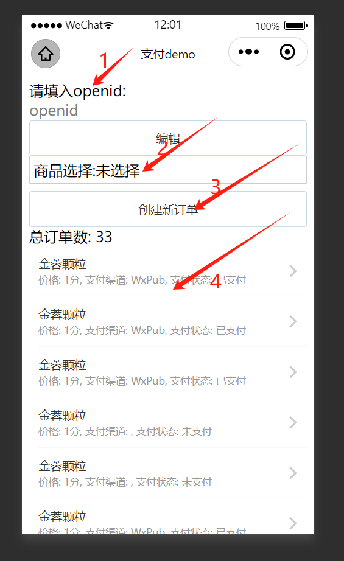

# 微信小程序支付demo

1. 打开[微信开发者工具](https://developers.weixin.qq.com/miniprogram/dev/devtools/download.html)，选择「小程序」，点击「添加项目」，填写小程序的 AppID，点击「确定」。
2. 在[微信公众平台](https://mp.weixin.qq.com/)中，选择「开发」->「开发设置」，将微信开发者工具中的 AppID 填写到「开发者ID」中，点击「确定」。
3. 选择「详情」 ->「本地开发」，勾选不校验合法域名、web-view（业务域名）、TLS 版本以及 HTTPS 证书，点击「确定」。
4. 进入[demo目录](../../../pay-demo-taroui)打开终端

    使用 npm 安装 CLI
    $ npm install -g @tarojs/cli
    使用pnpm安装依赖
    $ pnpm install
    使用 npm 编译运行
    $ npm run dev:weapp

5. 选择编译模式后刷新微信开发者工具，即可看到效果。

## 支付功能测试

openid可以在通过[Simple Admin Member](https://doc.ryansu.tech/zh/guide/official-comp/member.html)模块中获取

