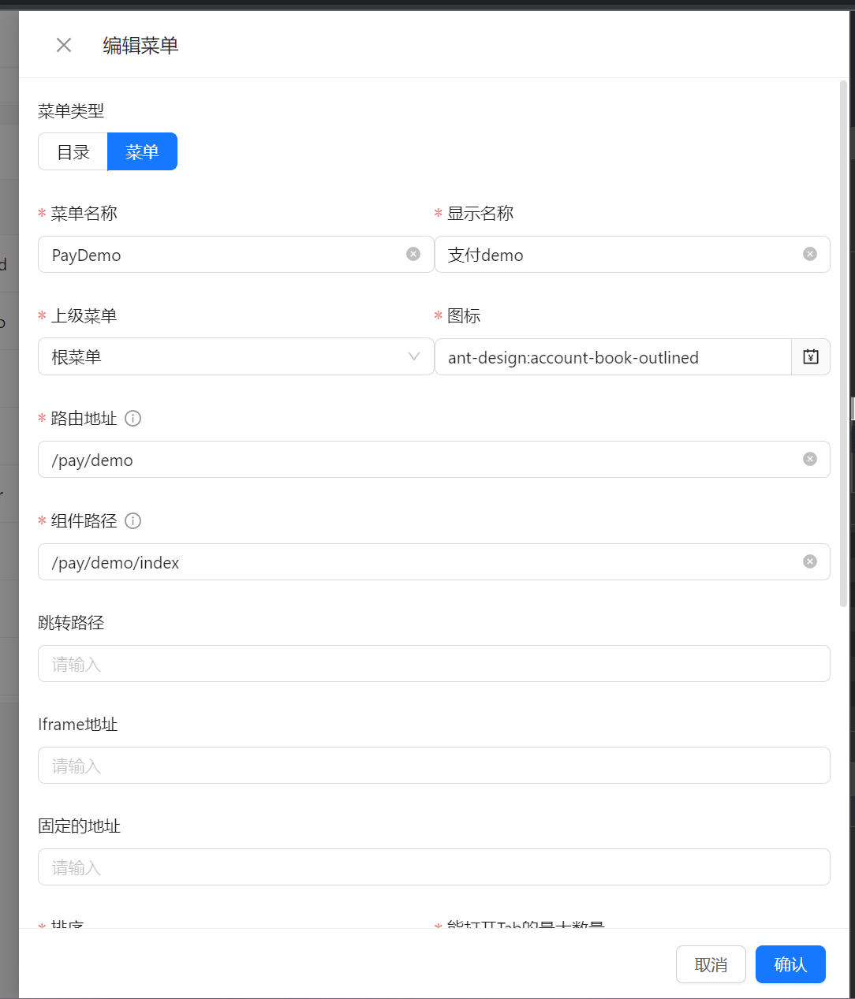
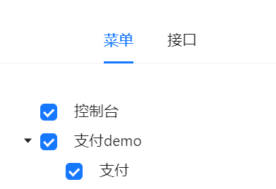

# 支付宝支付demo

1. 示例项目必须运行[simple-admin-backend-ui](https://github.com/agui-coder/simple-admin-backend-ui)
fork 的项目和[simple-admin-job](https://github.com/agui-coder/simple-admin-job)fork项目的pay-job分支，否则项目无法收到支付完成的回调信息，需要在本地启动后端服务，具体的可以参考[Simple Admin](https://doc.ryansu.tech/zh/guide/basic-config/env_setting.html)

    使用 npm 安装 CLI
    $ pnpm install
    使用 npm 编译运行
    $ npm run dev

2. 配置PayDemo菜单

3. 配置权限

4. 支付测试
